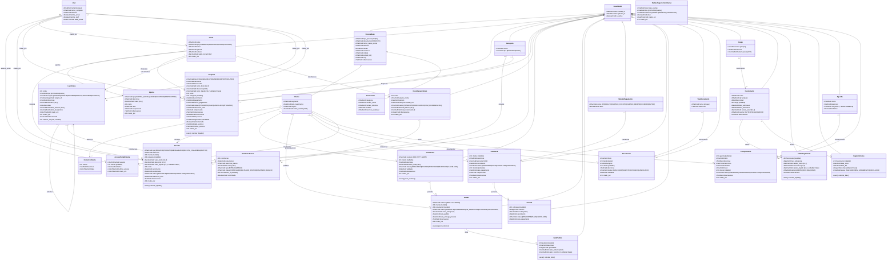

# Diagrama de Classes — UidCore

```mermaid
classDiagram
    class BaseModel {
        +DateTimeField created_at
        +DateTimeField updated_at
        +BooleanField is_active
    }

    class PessoaBase {
        +CharField tipo_pessoa [PF|PJ]
        +CharField documento [CPF|CNPJ]
        +CharField nome_razao_social
        +CharField telefone
        +EmailField email
        +CharField endereco
        +CharField cidade
        +CharField estado [UF]
        +CharField cep
        +TextField observacoes
    }

    BaseModel <|-- PessoaBase

    class User {
        +EmailField email [unique]
        +CharField nome_completo
        +CharField telefone
        +BooleanField is_active
        +BooleanField is_staff
        +DateTimeField date_joined
    }

    class Cliente {
        +CharField segmento
        +DateField data_nascimento
        +CharField origem
        +DecimalField limite_credito [12,2]
    }

    PessoaBase <|-- Cliente

    class HistoricoCliente {
        +FK cliente
        +TextField descricao
        +DateTimeField data
    }

    Cliente "1" --> "0..*" HistoricoCliente : historico

    class Fornecedor {
        +CharField categoria
        +CharField contato_nome
        +CharField contato_telefone
        +URLField website
        +CharField inscricao_estadual
    }

    PessoaBase <|-- Fornecedor

    class Conta {
        +CharField nome
        +CharField tipo [CORRENTE|POUPANCA|CAIXA|CARTEIRA]
        +CharField banco
        +CharField agencia
        +CharField numero
        +DecimalField saldo_inicial [12,2]
        +FK criado_por
    }

    BaseModel <|-- Conta

    class Aporte {
        +CharField tipo [CAPITAL_SOCIAL|SOCIO|INVESTIDOR|EMPRESTIMO]
        +CharField descricao
        +DecimalField valor [12,2]
        +FK conta
        +DateField data
        +CharField responsavel
        +TextField observacoes
        +FK criado_por
    }

    BaseModel <|-- Aporte
    Conta "1" --> "0..*" Aporte : aportes

    class Categoria {
        +CharField nome
        +CharField tipo [ENTRADA|SAIDA]
    }

    BaseModel <|-- Categoria

    class Receita {
        +CharField tipo [SERVICO|PRODUTO|MENSALIDADE|RECEITA_FINANCEIRA|OUTRO]
        +CharField descricao
        +FK cliente [nullable]
        +FK categoria [nullable]
        +DecimalField valor_bruto [12,2]
        +DecimalField desconto [12,2]
        +DecimalField valor_liquido [12,2, editable=False]
        +FK conta
        +DateField vencimento
        +DateField recebimento
        +CharField status [PENDENTE|RECEBIDO|CANCELADO|ATRASADO]
        +DateField referencia_mes
        +TextField observacoes
        +FK criado_por
        +save() calcular_liquido()
    }

    BaseModel <|-- Receita
    Cliente "0..1" --> "0..*" Receita : receitas
    Conta "1" --> "0..*" Receita : receitas
    Categoria "0..1" --> "0..*" Receita : receitas

    class Despesa {
        +CharField tipo [FIXA|VARIAVEL|PROLABORE|IMPOSTO|OUTRO]
        +CharField descricao
        +CharField fornecedor
        +DecimalField valor_bruto [12,2]
        +DecimalField desconto [12,2]
        +DecimalField valor_liquido [12,2, editable=False]
        +FK conta
        +FK categoria [nullable]
        +DateField vencimento
        +DateField pagamento
        +CharField forma_pagamento
        +CharField status [PENDENTE|PAGO|CANCELADO|ATRASADO]
        +DateField referencia_mes
        +FileField comprovante
        +TextField observacoes
        +BooleanField recorrente
        +CharField frequencia
        +PositiveIntegerField quantidade
        +BooleanField estornado
        +DateField data_estorno
        +TextField motivo_estorno
        +FK criado_por
        +save() calcular_liquido()
    }

    BaseModel <|-- Despesa
    Conta "1" --> "0..*" Despesa : despesas
    Categoria "0..1" --> "0..*" Despesa : despesas

    class LivroCaixa {
        +FK conta
        +CharField tipo [ENTRADA|SAIDA]
        +CharField origem [APORTE|RECEITA|DESPESA|MANUAL|TRANSFER|ESTORNO]
        +PositiveIntegerField origem_id
        +CharField descricao
        +DecimalField valor [12,2]
        +DateField data
        +DecimalField saldo_anterior [12,2]
        +DecimalField saldo_atual [12,2]
        +DateTimeField criado_em
        +FK criado_por
        +BooleanField estornado
        +FK estorno_de [self, nullable]
    }

    Conta "1" --> "0..*" LivroCaixa : lancamentos
    LivroCaixa "0..1" --> "0..*" LivroCaixa : estornos

    class ConciliacaoExtrato {
        +FK conta
        +CharField arquivo_nome
        +DateField periodo
        +DateTimeField processado_em
        +CharField status [PENDENTE|PROCESSADO|COM_DIVERGENCIAS]
        +DecimalField total_banco [12,2]
        +DecimalField total_sistema [12,2]
        +IntegerField divergencias
        +FK criado_por
    }

    BaseModel <|-- ConciliacaoExtrato
    Conta "1" --> "0..*" ConciliacaoExtrato : conciliacoes

    class ItemConciliacao {
        +FK conciliacao
        +DateField data_banco
        +CharField descricao_banco
        +DecimalField valor [12,2]
        +CharField tipo [ENTRADA|SAIDA]
        +CharField status [CONCILIADO|FALTANDO_SISTEMA|FALTANDO_BANCO]
        +FK lancamento_lc [nullable]
        +BooleanField confirmado
    }

    ConciliacaoExtrato "1" --> "0..*" ItemConciliacao : itens
    LivroCaixa "0..1" --> "0..*" ItemConciliacao : conciliacoes

    class PadraoSeguroConciliacao {
        +CharField descricao_padrao
        +CharField tipo [ENTRADA|SAIDA]
        +CharField natureza [APORTE|RECEITA_FINANCEIRA]
        +BooleanField ativo
        +DateTimeField criado_em
        +FK criado_por
    }

    class Orcamento {
        +CharField numero [ORC-YYYY-NNNN]
        +FK cliente [nullable]
        +TextField descricao
        +DecimalField valor_total [12,2]
        +CharField status [RASCUNHO|ENVIADO|APROVADO|REJEITADO|CANCELADO]
        +DateField validade
        +TextField observacoes
        +FK criado_por
        +save() gerar_numero()
    }

    BaseModel <|-- Orcamento
    Cliente "0..1" --> "0..*" Orcamento : orcamentos

    class Pedido {
        +CharField numero [PED-YYYY-NNNN]
        +FK cliente [nullable]
        +FK orcamento [nullable]
        +CharField status [PENDENTE|CONFIRMADO|EM_PRODUCAO|ENTREGUE|CANCELADO]
        +DecimalField valor_total [12,2]
        +DateField data_pedido
        +DateField data_entrega_prevista
        +TextField observacoes
        +FK criado_por
        +save() gerar_numero()
    }

    BaseModel <|-- Pedido
    Cliente "0..1" --> "0..*" Pedido : pedidos
    Orcamento "0..1" --> "0..*" Pedido : pedidos

    class ItemPedido {
        +FK pedido [nullable]
        +CharField descricao
        +IntegerField quantidade
        +DecimalField valor_unitario [12,2]
        +DecimalField valor_total [12,2, editable=False]
        +save() calcular_total()
    }

    BaseModel <|-- ItemPedido
    Pedido "1" --> "0..*" ItemPedido : itens

    class MetodoPagamento {
        +CharField nome [PIX|BOLETO|CARTAO_CREDITO|CARTAO_DEBITO|DINHEIRO|OUTRO]
        +BooleanField ativo
    }

    BaseModel <|-- MetodoPagamento

    class Cobranca {
        +FK cliente [nullable]
        +CharField descricao
        +DecimalField valor [12,2]
        +DateField vencimento
        +CharField status [PENDENTE|PAGO|CANCELADO|ATRASADO]
        +FK metodo [nullable]
        +DateField data_pagamento
        +FileField comprovante
        +TextField observacoes
        +FK criado_por
    }

    BaseModel <|-- Cobranca
    Cliente "0..1" --> "0..*" Cobranca : cobrancas
    MetodoPagamento "0..1" --> "0..*" Cobranca : cobrancas

    class Parcela {
        +FK cobranca [nullable]
        +IntegerField numero
        +DecimalField valor [12,2]
        +DateField vencimento
        +CharField status [PENDENTE|PAGO|CANCELADO]
        +DateField data_pagamento
    }

    BaseModel <|-- Parcela
    Cobranca "1" --> "0..*" Parcela : parcelas

    class TipoDocumento {
        +CharField nome [unique]
        +TextField descricao
    }

    BaseModel <|-- TipoDocumento

    class Documento {
        +CharField titulo
        +FK tipo [nullable]
        +FileField arquivo
        +FK cliente [nullable]
        +TextField descricao
        +CharField status [RASCUNHO|VIGENTE|EXPIRADO|CANCELADO]
        +DateField validade
        +FK criado_por
    }

    BaseModel <|-- Documento
    TipoDocumento "0..1" --> "0..*" Documento : documentos
    Cliente "0..1" --> "0..*" Documento : documentos

    class Cargo {
        +CharField nome [unique]
        +TextField descricao
        +DecimalField salario_base [12,2]
    }

    BaseModel <|-- Cargo

    class Funcionario {
        +CharField nome
        +CharField cpf [unique]
        +EmailField email
        +FK cargo [nullable]
        +DateField data_admissao
        +DateField data_demissao
        +DecimalField salario_atual [12,2]
        +CharField regime [CLT|PJ|ESTAGIO|SOCIO]
        +TextField observacoes
    }

    BaseModel <|-- Funcionario
    Cargo "0..1" --> "0..*" Funcionario : funcionarios

    class FolhaPagamento {
        +FK funcionario [nullable]
        +DateField mes_referencia
        +DecimalField salario_bruto [12,2]
        +DecimalField descontos [12,2]
        +DecimalField salario_liquido [12,2, editable=False]
        +CharField status [ABERTA|FECHADA|PAGA]
        +TextField observacoes
        +save() calcular_liquido()
    }

    BaseModel <|-- FolhaPagamento
    Funcionario "1" --> "0..*" FolhaPagamento : folhas

    class RegistroFerias {
        +FK funcionario [nullable]
        +DateField data_inicio
        +DateField data_fim
        +IntegerField dias [editable=False]
        +CharField status [AGENDADO|EM_ANDAMENTO|CONCLUIDO]
        +save() calcular_dias()
    }

    BaseModel <|-- RegistroFerias
    Funcionario "1" --> "0..*" RegistroFerias : ferias

    class Agenda {
        +CharField nome
        +TextField descricao
        +CharField cor [max=7, default=#3B82F6]
        +BooleanField ativo
    }

    BaseModel <|-- Agenda

    class Compromisso {
        +FK agenda [nullable]
        +CharField titulo
        +TextField descricao
        +DateTimeField inicio
        +DateTimeField fim
        +CharField local
        +FK cliente [nullable]
        +CharField status [AGENDADO|CONFIRMADO|CANCELADO|CONCLUIDO]
        +TextField observacoes
        +FK criado_por
    }

    BaseModel <|-- Compromisso
    Agenda "0..1" --> "0..*" Compromisso : compromissos
    Cliente "0..1" --> "0..*" Compromisso : compromissos

    class AcessoPortalCliente {
        +OneToOneField usuario
        +FK cliente [nullable]
        +BooleanField ativo
        +DateTimeField ultimo_acesso
        +DateTimeField criado_em
    }

    User "1" --> "0..1" AcessoPortalCliente : acesso_portal
    Cliente "1" --> "0..*" AcessoPortalCliente : acessos_portal

    User "0..*" --> "0..*" Conta : criado_por
    User "0..*" --> "0..*" Receita : criado_por
    User "0..*" --> "0..*" Despesa : criado_por
    User "0..*" --> "0..*" LivroCaixa : criado_por
    User "0..*" --> "0..*" Aporte : criado_por
```
