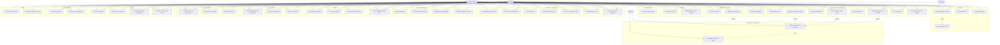

# Diagrama de Casos de Uso — UidCore

```mermaid
graph TB
    ADMIN([ADMIN])
    OPER([OPERACIONAL])
    CLIENTE([CLIENTE])
    SISTEMA([Sistema])

    subgraph Accounts
        UC_LOGIN[Login com Email e Senha]
        UC_REFRESH[Renovar Token JWT]
        UC_PERFIL[Ver e Editar Perfil]
        UC_REGISTER[Cadastrar Usuario]
    end

    subgraph Clientes
        UC_CLI_CRUD[Gerenciar Clientes]
        UC_CLI_HIST[Registrar Historico de Cliente]
    end

    subgraph Fornecedores
        UC_FOR_CRUD[Gerenciar Fornecedores]
    end

    subgraph Financeiro_Contas[Financeiro - Contas]
        UC_CONTA_CRUD[Gerenciar Contas]
        UC_CONTA_TRANSF[Transferir entre Contas]
    end

    subgraph Financeiro_Lancamentos[Financeiro - Lancamentos]
        UC_CAT_CRUD[Gerenciar Categorias]
        UC_REC_CRUD[Gerenciar Receitas]
        UC_REC_RECEBER[Marcar Receita como Recebida]
        UC_DES_CRUD[Gerenciar Despesas]
        UC_DES_PAGAR[Marcar Despesa como Paga]
        UC_DES_ESTORNAR[Estornar Despesa]
        UC_APO_CRUD[Registrar Aporte de Capital]
        UC_LC_VER[Ver Livro Caixa]
        UC_LC_ESTORNAR[Estornar Lancamento Manual]
    end

    subgraph Financeiro_Relatorios[Financeiro - Relatorios]
        UC_DASH[Ver Dashboard Financeiro]
        UC_FLUXO[Ver Fluxo de Caixa Mensal]
        UC_DRE[Ver DRE Anual]
        UC_BALANCO[Ver Balanco Patrimonial]
        UC_PROJETADO[Ver Fluxo Projetado 90 dias]
        UC_INDICADORES[Ver Indicadores CFO]
        UC_INFERIR[Inferir Categoria por Descricao]
    end

    subgraph Conciliacao[Conciliacao Bancaria]
        UC_CONC_UPLOAD[Fazer Upload de Extrato PDF]
        UC_CONC_LISTA[Listar Conciliacoes]
        UC_CONC_ITENS[Ver Itens de Conciliacao]
        UC_CONC_CONFIRMAR[Confirmar Item Divergente]
        UC_PADRAO_CRUD[Gerenciar Padroes Seguros]
    end

    subgraph Vendas
        UC_ORC_CRUD[Gerenciar Orcamentos]
        UC_PED_CRUD[Gerenciar Pedidos]
        UC_ITEM_CRUD[Gerenciar Itens de Pedido]
    end

    subgraph Pagamentos
        UC_MET_CRUD[Gerenciar Metodos de Pagamento]
        UC_COB_CRUD[Gerenciar Cobrancas]
        UC_PAR_CRUD[Gerenciar Parcelas]
    end

    subgraph Administrativo
        UC_TIPODOC_CRUD[Gerenciar Tipos de Documento]
        UC_DOC_CRUD[Gerenciar Documentos]
        UC_DOC_DOWNLOAD[Baixar Documento]
    end

    subgraph RH
        UC_CARGO_CRUD[Gerenciar Cargos]
        UC_FUNC_CRUD[Gerenciar Funcionarios]
        UC_FOLHA_CRUD[Gerenciar Folhas de Pagamento]
        UC_FERIAS_CRUD[Registrar e Gerenciar Ferias]
    end

    subgraph Agendamento
        UC_AGENDA_CRUD[Gerenciar Agendas]
        UC_COMP_CRUD[Gerenciar Compromissos]
    end

    subgraph Portal
        UC_PORT_CRIAR[Criar Acesso ao Portal]
        UC_PORT_DESATIVAR[Desativar Acesso ao Portal]
    end

    subgraph Automacoes[Automacoes do Sistema]
        UC_SIGNAL_LC[Gerar Lancamento no LivroCaixa]
        UC_RECONSTRUIR[Reconstruir Cadeia de Saldos]
    end

    ADMIN --> UC_LOGIN
    OPER --> UC_LOGIN
    CLIENTE --> UC_LOGIN
    UC_LOGIN -.->|inclui| UC_REFRESH

    ADMIN --> UC_REGISTER
    ADMIN --> UC_PERFIL
    OPER --> UC_PERFIL

    ADMIN --> UC_CLI_CRUD
    OPER --> UC_CLI_CRUD
    ADMIN --> UC_CLI_HIST
    OPER --> UC_CLI_HIST

    ADMIN --> UC_FOR_CRUD
    OPER --> UC_FOR_CRUD

    ADMIN --> UC_CONTA_CRUD
    OPER --> UC_CONTA_CRUD
    ADMIN --> UC_CONTA_TRANSF
    OPER --> UC_CONTA_TRANSF

    ADMIN --> UC_CAT_CRUD
    OPER --> UC_CAT_CRUD

    ADMIN --> UC_REC_CRUD
    OPER --> UC_REC_CRUD
    ADMIN --> UC_REC_RECEBER
    OPER --> UC_REC_RECEBER

    ADMIN --> UC_DES_CRUD
    OPER --> UC_DES_CRUD
    ADMIN --> UC_DES_PAGAR
    OPER --> UC_DES_PAGAR
    ADMIN --> UC_DES_ESTORNAR

    ADMIN --> UC_APO_CRUD

    ADMIN --> UC_LC_VER
    OPER --> UC_LC_VER
    ADMIN --> UC_LC_ESTORNAR

    ADMIN --> UC_DASH
    OPER --> UC_DASH
    ADMIN --> UC_FLUXO
    OPER --> UC_FLUXO
    ADMIN --> UC_DRE
    OPER --> UC_DRE
    ADMIN --> UC_BALANCO
    OPER --> UC_BALANCO
    ADMIN --> UC_PROJETADO
    OPER --> UC_PROJETADO
    ADMIN --> UC_INDICADORES
    OPER --> UC_INDICADORES
    ADMIN --> UC_INFERIR
    OPER --> UC_INFERIR

    ADMIN --> UC_CONC_UPLOAD
    OPER --> UC_CONC_UPLOAD
    ADMIN --> UC_CONC_LISTA
    OPER --> UC_CONC_LISTA
    ADMIN --> UC_CONC_ITENS
    OPER --> UC_CONC_ITENS
    ADMIN --> UC_CONC_CONFIRMAR
    OPER --> UC_CONC_CONFIRMAR
    ADMIN --> UC_PADRAO_CRUD
    OPER --> UC_PADRAO_CRUD

    ADMIN --> UC_ORC_CRUD
    OPER --> UC_ORC_CRUD
    ADMIN --> UC_PED_CRUD
    OPER --> UC_PED_CRUD
    ADMIN --> UC_ITEM_CRUD
    OPER --> UC_ITEM_CRUD

    ADMIN --> UC_MET_CRUD
    OPER --> UC_MET_CRUD
    ADMIN --> UC_COB_CRUD
    OPER --> UC_COB_CRUD
    ADMIN --> UC_PAR_CRUD
    OPER --> UC_PAR_CRUD

    ADMIN --> UC_TIPODOC_CRUD
    OPER --> UC_TIPODOC_CRUD
    ADMIN --> UC_DOC_CRUD
    OPER --> UC_DOC_CRUD
    ADMIN --> UC_DOC_DOWNLOAD
    OPER --> UC_DOC_DOWNLOAD
    CLIENTE --> UC_DOC_DOWNLOAD

    ADMIN --> UC_CARGO_CRUD
    OPER --> UC_CARGO_CRUD
    ADMIN --> UC_FUNC_CRUD
    OPER --> UC_FUNC_CRUD
    ADMIN --> UC_FOLHA_CRUD
    OPER --> UC_FOLHA_CRUD
    ADMIN --> UC_FERIAS_CRUD
    OPER --> UC_FERIAS_CRUD

    ADMIN --> UC_AGENDA_CRUD
    OPER --> UC_AGENDA_CRUD
    ADMIN --> UC_COMP_CRUD
    OPER --> UC_COMP_CRUD

    ADMIN --> UC_PORT_CRIAR
    ADMIN --> UC_PORT_DESATIVAR

    UC_REC_RECEBER -.->|estende| UC_SIGNAL_LC
    UC_DES_PAGAR -.->|estende| UC_SIGNAL_LC
    UC_APO_CRUD -.->|estende| UC_SIGNAL_LC
    UC_CONTA_TRANSF -.->|estende| UC_SIGNAL_LC
    UC_SIGNAL_LC -.->|inclui| UC_RECONSTRUIR
    SISTEMA --> UC_SIGNAL_LC
    SISTEMA --> UC_RECONSTRUIR
```
